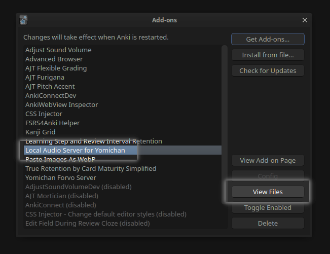
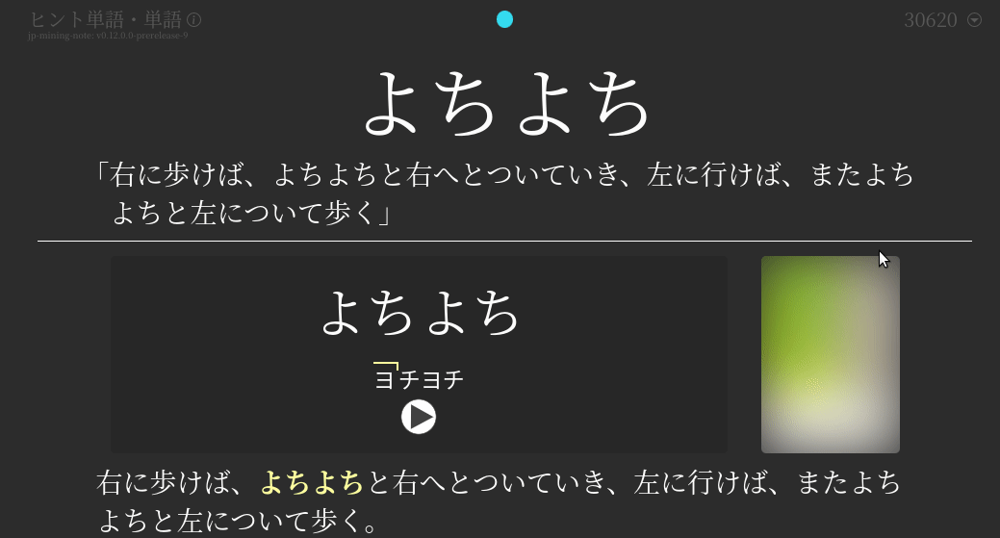
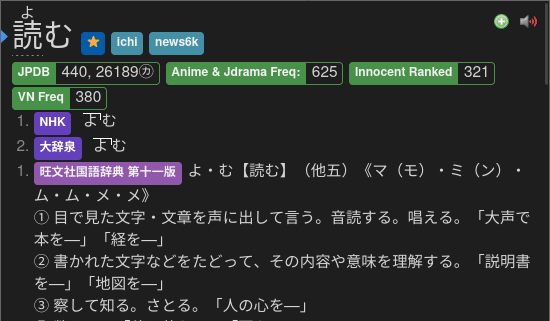
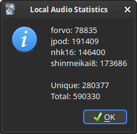

# Local Audio Server for Yomichan

This [Anki add-on](https://ankiweb.net/shared/info/1045800357)
runs a local server of which Yomichan can fetch audio files from,
using a database containing over 250,000 unique expressions.
With this setup, you are able to create Anki cards nearly instantaneously,
and get word audio without a working internet connection.

Core maintainer: [**@Aquafina-water-bottle**](https://www.github.com/Aquafina-water-bottle)

<sup>
P.S. Feel free to check out <a href="https://aquafina-water-bottle.github.io/jp-mining-note/jpresources/">my other resources</a> if you're interested!
</sup>

## Reasons for and against this setup

<details> <summary><b>Advantages:</b> <i>(click here)</i> </summary>

1. Most audio is gotten in **almost instantly**. Without the local audio server,
    fetching the audio can take anywhere from one second to a full minute
    (on particularly bad days).

    Most of the delay from Yomichan when creating cards is from fetching the audio.
    In other words, getting the audio is the main bottleneck of when creating Anki cards.
    This add-on removes the aforementioned bottleneck, meaning **you can make cards with virtually 0 delay**.

1. If you do not have internet access, you can still add audio to your cards.

1. Compared to standard Yomichan, this **improves audio coverage** because it adds various sources not covered by Yomichan, such as Forvo, NHK 2016, and Shinmeikai 8.

1. Much [pre-processing](https://github.com/Aquafina-water-bottle/local-audio-yomichan-build-scripts) has been done to this audio to make it as high quality as possible:
    - All audio is normalized, so the volume remains relatively similar for each file.
    - Silence has been trimmed from the beginning and end of each file.

</details>

<details> <summary><b>Disadvantages:</b> <i>(click here)</i> </summary>

1. This setup requires about **3 GB of free space**.

1. This setup requires Anki to be open or the server to be [run manually](#running-without-anki) in order for Yomichan to fetch audio from it. However, Yomichan can still fall back to its default sources if `local-audio-yomichan` is unavailable or does not have the requested word.

</details>


## Steps

These instructions setup the local audio server for the PC (Windows, MacOS, Linux) release of Anki.
If you wish to use this on Android, see [here](https://github.com/KamWithK/AnkiconnectAndroid).
There is currently no way of using this on AnkiMobile (iOS).

1. Download all the required audio files. You have three main options:

    1.  <details>
        <summary><b>Ogg/Opus audio (2.5 GiB) (Recommended)</b></summary>

        > The [Opus](https://opus-codec.org/) audio codec provides much better quality at lower bitrates (which saves a lot of space and makes syncing large collections faster). However, **Opus is NOT compatible with the following**:
        > - **AnkiMobile on iOS**
        > - Very old Android devices (Android 4 and below)
        > - AnkiWeb
        >
        > <br>
        > If you use Anki under any of the above, please use the 2nd option (MP3 audio) below.
        >
        > - Download torrent (magnet link)

        </details>

    1.  <details>
        <summary>MP3 audio (4.9 GiB)</summary>

        > Older and less efficient codec, but needed for compatibility with pretty much all devices.
        > - Download torrent (magnet link)

        </details>

    1.  <details>
        <summary>Original audio (5.4 GiB)</summary>

        > The completely raw, unprocessed audio files. *Only download this if you know what you are doing.* This will contain duplicates, a few broken files, differing audio quality, and different codecs per source. See [the build scripts](https://github.com/Aquafina-water-bottle/local-audio-yomichan-build-scripts) for how this original audio was filtered and processed to create the above collections.
        > - Download torrent (magnet link)

        </details>

    If you have never downloaded from a torrent before, I highly recommend using the
    [qBittorrent](https://www.qbittorrent.org/) client.

2. Extract the `.tar.xz` file.
    * **Windows** users can use [7zip](https://7-zip.org/download.html).
    * **Linux and MacOS** users can use either the default GUI archive manager or the `tar -xf` command.

3. [Download the add-on](https://ankiweb.net/shared/info/1045800357):
    * Within Anki, navigate to `Tools` →  `Add-ons` →  `Get Add-ons...`
    * Copy and paste this code: `1045800357`

        

    This add-on only works for Anki versions 2.1.50 and above.
    If you are using Anki versions 2.1.49 or below, I highly recommend updating.
    If you can't do this for whatever reason, the legacy instructions and add-on can be found
    [here](https://github.com/themoeway/local-audio-yomichan/tree/old).

4. Move the downloaded audio files to the correct place.
    * Within the same Add-ons window, select the add-on (`Local Audio Server for Yomichan`).
    * Click `View files` to the right. Your file explorer should now be under `Anki2/addons21/1045800357`.

        

    * Copy the entire `user_files` folder (from the second step) into this folder.

        <details> <summary>Expected file structure <i>(click here)</i></summary>

            1045800357
            ├── db_utils.py
            ├── server.py
            ├── ...
            └── user_files
                ├── jmdict_forms.json
                ├── forvo_files
                │   ├── akitomo
                │   │   └── 目的.opus
                │   ├── kaoring
                │   │   └── ...
                │   └── ...
                ├── jpod_files
                │   ├── media
                │   │   ├── 000113d2d8419a26e97eacc0b7cfd675.opus
                │   │   ├── 0001d108dd8f99509769192effc1f9e4.opus
                │   │   └── ...
                │   ├── index.json
                │   └── source_meta.json
                ├── nhk16_files
                │   ├── audio
                │   │   ├── 20170616125910.opus
                │   │   └── ...
                │   └── entries.json
                └── shinmeikai8_files
                    ├── media
                    │   ├── 00001.opus
                    │   ├── 00002.opus
                    │   └── ...
                    └── index.json

        </details>

5. Add the URL in Yomichan.

    * In Yomichan Settings , go to:
      > `Audio` →  `Configure audio playback sources`.

    * Set the first source to be `Custom URL (JSON)`.
    * Under the first source, set the `URL` field to:
        ```
        http://localhost:5050/?term={term}&reading={reading}
        ```
    * If you have other sources, feel free to re-add them under the first source.

    


6. Restart Anki. You should see a message saying "Generating local audio database",
    and should take some time to finish.

7. Ensure that everything works. To do this, play some audio from Yomichan.
    You should notice two things:

    - The audio should be played almost immediately after clicking the play button.
        Note that if you're using the memory based version,
        the first audio play will take a while to load as mentioned above (in the comparison).
    - After playing the audio, you should be able to see the available sources
        by right-clicking on the play button.

        Here is an example for 読む:

        

    Play all the sources from the above (読む) to ensure the sound is properly fetched.


## Optional Steps: Backfill cards
DillonWall made [a fantastic add-on](https://github.com/DillonWall/generate-batch-audio-anki-addon)
that can backfill cards from any custom URL, including this local audio server.


## Optional Steps: Online Forvo Audio Source
To increase audio coverage, I recommend including an extra
[Forvo audio source](https://learnjapanese.moe/yomichan/#bonus-adding-forvo-extra-audio-source).
Although the audio is fetched online, this vastly improves coverage compared to the
standard Yomichan sources and this local audio server.


## Troubleshooting
These are additional instructions and tips if something doesn't work as expected.

*   Make sure the database was properly generated.

    

    To determine if the database was properly generated,
    navigate to `Tools` →  `Local Audio Server` →  `Get number of entries per source`.
    The expected result is the image to the right:

    If there are missing sources, or you see "Database is empty", that means that
    the audio files were either misplaced, or Anki was restarted before moving
    the audio files into the proper location.

    Ensure that within step 4, your file structure matches the expected file structure,
    and then try regenerating the database
    by navigating to `Tools` →  `Local Audio Server` →  `Regenerate database`.

*   Ensure you haven't copied any files from the torrent outside of `user_files`.
    If you have (or suspect you may have):
    * Temporarily move the `user_files` folder outside of the add-on folder (to avoid re-downloading the audio files torrent again).
    * Delete the add-on.
    * Start again from step 3.

*   If nothing else works, you have questions, etc., feel free to contact
    me on discord `Aquafina water bottle#3026`,
    or [submit an issue](https://github.com/themoeway/local-audio-yomichan/issues).
    I exist on the [TheMoeWay](https://learnjapanese.moe/join/) (see [this thread](https://discord.com/channels/617136488840429598/1074057444365443205)) and Refold (Japanese) servers.


## Configuring sources

* If you wish to reorder the priority of sources or remove sources,
    you can specify the sources using the custom URL.

    Here are a few examples:

    *   <details>
        <summary>JPod, NHK16, Shinmeikai8, Forvo (the original default order)</summary>

        ```
        http://localhost:5050/?term={term}&reading={reading}&sources=jpod,nhk16,shinmeikai8,forvo
        ```

        </details>

    *   <details>
        <summary>NHK16, Shinmeikai8, Forvo (JPod will never be fetched!)</summary>

        ```
        http://localhost:5050/?term={term}&reading={reading}&sources=nhk16,shinmeikai8,forvo
        ```

        </details>

* For Forvo audio specifically, you can modify the priority of users by using `&user=`.

    For example, the following will get Forvo audio in the priority of strawberrybrown, then akitomo. All other users **will not be included in the search**.
    ```
    http://localhost:5050/?term={term}&reading={reading}&user=strawberrybrown,akitomo
    ```

## Config File

If you want even more power, sources can be manually configured using a config file.
On top of changing the priority of sources and removing sources, you can do the following:
- Specify a path for each source folder. You can use this to store audio files in a different drive.
- Add entirely new audio sources

### Config Setup

1. Within the same Add-ons window, select the add-on (`Local Audio Server for Yomichan`).
1. Click `View files` to the right. Your file explorer should now be under `Anki2/addons21/1045800357`.
1. Copy `default_config.json` into `user_files`, and rename it as `config.json`.

    <details> <summary>Expected file structure <i>(click here)</i></summary>

        1045800357
        ├── db_utils.py
        ├── server.py
        ├── default_config.json
        ├── ...
        └── user_files
            ├── config.json <-- Create this file!
            ├── forvo_files
            │   └── ...
            ├── shinmeikai8_files
            │   └── ...
            ├── jpod_files
            │   └── ...
            └── nhk16_files
                └── ...

    </details>

### Config Usage Notes
- Whenever you edit your config, make sure you restart Anki and regenerate the database.
    This will ensure your changes are fully applied.
- Do NOT edit `default_config.json`, because this file will get overwritten on every add-on update.
- If you want to change the priority of sources, ensure that your custom URL does NOT have the `sources` parameter.
    The URL `sources` parameter overrides the config's source priority!


## Running without Anki
If you wish to run the server without Anki, do the following:
```bash
git clone https://github.com/themoeway/local-audio-yomichan.git
cd local-audio-yomichan

# You must fill `plugin/user_files` with the audio files, like with step 3 of the main instructions.
# If you are on a *unix OS and you have already setup the Anki add-on, you can run the command below:
ln -s ~/.local/share/Anki2/addons21/1045800357/user_files ./plugin/user_files

# After filling in `plugin/user_files` with the audio files, you can now run the server.
# Ensure you have python 3.9 or above.
python3 run_server.py
```

## Install from Source
- For Windows users, the link script requires a bit of effort to run.
    Instructions can be found at the top of the [`link.ps1`](./link.ps1) script.

- Linux and MacOS users can run:
    ```bash
    git clone https://github.com/themoeway/local-audio-yomichan.git
    cd local-audio-yomichan
    ./link.sh
    ```

## Credits & Acknowledgements
A lot of people came together, one way or the other, to get this add-on to where it is today.
Huge thanks to everyone who made it happen:

* **Zetta#3033**: Creator of the original addon + gave advice for improving query speed
* **kezi#0001**: Getting NHK16 audio
* **(anonymous)**: Adding SQL + NHK16 audio support
* **[@Renji-XD](https://github.com/Renji-XD)**: Getting Forvo audio, adding Forvo audio support
* **[@tatsumoto-ren](https://github.com/tatsumoto-ren)**: [Getting Shinmeikai 8 audio](https://github.com/Ajatt-Tools/shinmeikai_8_pronunciations_index)
* **[@MarvNC](https://github.com/MarvNC)**: Creating and maintaining the torrent + testing out the rewritten add-on
* **[@shoui520](https://github.com/shoui520)**: Maintaining and popularizing the original set of instructions that these instructions were initially based off of
* **[@ctpk](https://github.com/ctpk)**: Investigated and patched a bug with `.aac` files not having the correct mime type
* **[@Mansive](https://github.com/Mansive)**: Helped with [pre-processing the audio](https://github.com/Aquafina-water-bottle/local-audio-yomichan-build-scripts)
* **[@tsweet64](https://github.com/tsweet64)**: Added support for more audio types, and helped with [pre-processing the audio](https://github.com/Aquafina-water-bottle/local-audio-yomichan-build-scripts)
* **[@jamesnicolas](https://github.com/jamesnicolas)**: Creator of [Yomichan Forvo Server for Anki](https://github.com/jamesnicolas/yomichan-forvo-server). The original code was heavily based off of this project.
* **[@KamWithK](https://github.com/KamWithK)**: Creator of [Ankiconnect Android](https://github.com/KamWithK/AnkiconnectAndroid). This allows the local audio server to work on Android. Also gave advice for improving the database.
* **[@DillonWall](https://github.com/DillonWall)**: Creator of [Generate Batch Audio](https://github.com/DillonWall/generate-batch-audio-anki-addon). This allows you to backfill existing cards with the local audio server, or anything else.


## License
[MIT](https://github.com/themoeway/local-audio-yomichan/blob/master/LICENSE)


## Other

<details> <summary>Notes on Forvo Audio Sourcing <i>(click here)</i></summary>

* The following is a slightly edited quote from person who got the Forvo audio:

    > The files for now only includes audio files with an exact 1:1 mapping of a dictionary/Marv's JPDB frequency list term to the name of the file the user uploaded. Just because you don't get audio for an user it does not mean the user has no audio on Forvo. Just because you get audio it does not mean it actually matches the current word/reading. It is also not uncommon that people pronounce multiple readings in the same file.

    The full quote can be found at the bottom of [the legacy instructions](https://github.com/themoeway/local-audio-yomichan/tree/old), under "Original Message for v09".

</details>


<details> <summary>Some Technical Information on the Audio <i>(click here)</i></summary>

* Opus audio has been encoded at 32k VBR.
* MP3 audio is encoded with LAME `V3` preset.

</details>


<details> <summary>Transferring from the deprecated add-on <i>(click here)</i></summary>

*   The expected display name of the addon is "Local Audio Server for Yomichan".
    If your addon has the name "Yomichan Local Audio Server", then you are using the deprecated version.

    To transfer from the deprecated addon to this addon, do the following:
    - Disable the old addon
    - Download the new add-on (`1045800357`)
    - Move the `user_files` folder from the old add-on's folder (likely `955441350`) to the new add-on's folder. Do not copy any other files from the old add-on
    - Restart Anki

    If that doesn't work for some reason, see the [troubleshooting section](#troubleshooting) (you might have to regenerate the database).

</details>


<details> <summary>Updating to the new audio <i>(click here)</i></summary>

*   New collections of audio for the Local Audio Server has been finally released! These new collections improve on the old collections quite a bit:
    * Forvo audio is very inconsistent in raw audio quality. To solve this, **we normalized all of the audio** (so the volume is mostly constant between all files) and stripped most silence from the ends of the audio files.
    * We now offer two collections: `opus` and `mp3`. The `opus` provides the most optimal storage format, whereas `mp3` collection provides the most compatible format. Most notably, **if you are using AnkiMobile, you can now use all audio sources** by using the `mp3` collection!
    * A new source has been added (thanks to [@tatsumoto-ren](https://github.com/tatsumoto-ren)): <ruby>新明解<rt>しんめいかい</rt></ruby>８ (internal id: `shinmeikai8`).
    * JPod files were found to be mostly contained of literal duplicate files. To solve this, we changed the internal storage format to simply link the correct words to unique files, which ended up clearing some 30% of the JPod database.
    * Using JMdict word variants data (JMdict Forms), we increased word coverage by mapping audio from variants to other variants with the same reading.

    However, credit where credit is due: None of this would have been possible
    (hell, none of this would've even started)
    if it wasn't for [@Mansive](https://github.com/Mansive), [@tsweet64](https://github.com/tsweet64),
    and their hard work on [these pre-processing scripts](https://github.com/Aquafina-water-bottle/local-audio-yomichan-build-scripts#local-audio-yomichan-build-scripts). Thanks once again for everything!

    If you are interested in updating your audio, here's what you'll need to do:

    1. Ensure the add-on is updated (`Tools` →  `Add-ons` →  `Check for Updates`)
    2. Navigate to this add-on folder:
        * Within the same Add-ons window, select the add-on (`Local Audio Server for Yomichan`).
        * Click `View files` to the right. Your file explorer should now be under `Anki2/addons21/1045800357`.
    3. Move the `user_files` folder somewhere findable (i.e. your desktop).
        This will serve as a backup in case anything fails.
    4. Download the desired audio from [step 1 of the standard instructions](#steps), extract the archive, and move the extracted `user_files` into the add-on folder.
    5. Restart Anki, and then regenerate the Local Audio Database (`Tools` →  `Local Audio Server` →  `Regenerate database`)
    6. Change your custom URL (JSON) value to the following:
        ```
        http://localhost:5050/?term={term}&reading={reading}
        ```
        This URL removes the `sources` parameter, so sources can be added without having to
        change the URL in the future. However, please note that the **default source order has changed**
        to `nhk16,shinmeikai8,forvo,jpod`, to optimize for Japanese correctness over literal audio quality.
        If you want to change the order the sources (i.e. to restore the previous default order), see
        [here](https://github.com/tsweet64/local-audio-yomichan/tree/better_audio_readme#configuring-sources).
    7. If you are using AnkiConnectAndroid, make sure to [regenerate the Android database and send it to your device](https://github.com/KamWithK/AnkiconnectAndroid#additional-instructions-local-audio).
    8. Enjoy your new audio!

</details>
